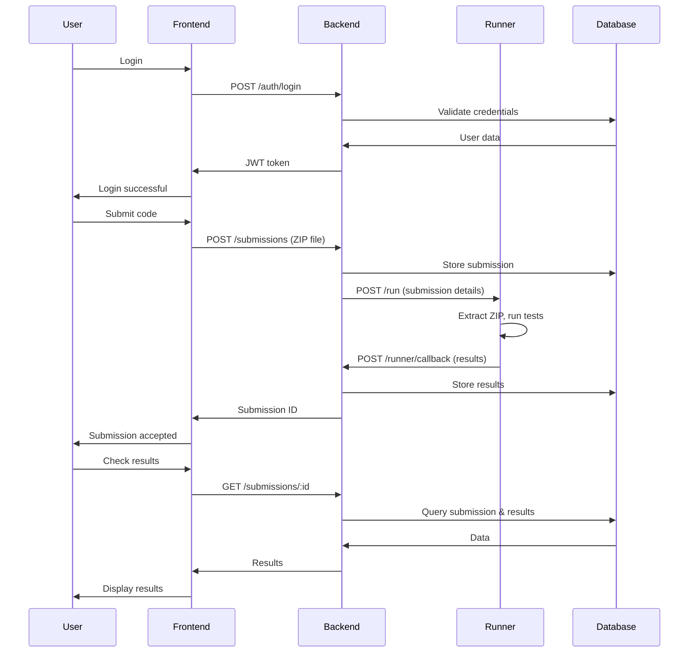

# Automated Code Assessment System - Vollständige Projekterklärung

## Übersicht

Dieses Projekt ist ein **Automatisiertes Code-Bewertungssystem (Automated Code Assessment)** zur Bewertung und zum Testen von Studentencode. Das System ermöglicht es Studenten, ihren Code einzureichen und automatisch bewertet zu bekommen.

## 🏗️ Architektur

Das System besteht aus **drei Hauptkomponenten**:

### 1. Backend (Node.js)
- **Framework:** Express.js
- **Datenbank:** SQLite mit better-sqlite3
- **Authentifizierung:** JWT
- **Datei-Upload:** Multer
- **Port:** 3000

### 2. Runner (Python/Flask)
- **Framework:** Flask
- **Test-Motor:** pytest
- **Berichtsformat:** JSON
- **Ausführungszeit:** Maximal 55 Sekunden
- **Port:** 5001

### 3. Frontend (Static)
- **Server:** Nginx
- **Port:** 5173

## 📋 Arbeitsprozess

### Schritt 1: Authentifizierung
```http
POST /auth/register
Content-Type: application/json

{
  "email": "student@example.com",
  "password": "password123",
  "role": "student"
}
```

```http
POST /auth/login
Content-Type: application/json

{
  "email": "student@example.com",
  "password": "password123"
}
```

### Schritt 2: Aufgaben anzeigen
```http
GET /assignments
Authorization: Bearer <JWT_TOKEN>
```

### Schritt 3: Code einreichen
```http
POST /submissions
Authorization: Bearer <JWT_TOKEN>
Content-Type: multipart/form-data

assignmentId: 1
file: solution.zip
```

### Schritt 4: Ergebnisse abrufen
```http
GET /submissions/:id
Authorization: Bearer <JWT_TOKEN>
```

## 🛠️ Technische Details

### Backend API Endpunkte

| Endpoint | Method | Beschreibung |
|----------|--------|--------------|
| `/auth/register` | POST | Benutzerregistrierung |
| `/auth/login` | POST | Anmeldung |
| `/assignments` | GET | Liste der Aufgaben abrufen |
| `/submissions` | POST | Code einreichen (ZIP-Upload) |
| `/submissions/:id` | GET | Einreichungsstatus und Ergebnisse abrufen |
| `/runner/callback` | POST | Runner-Callback für Ergebnisse |

### Runner API Endpunkte

| Endpoint | Method | Beschreibung |
|----------|--------|--------------|
| `/health` | GET | Gesundheitsprüfung |
| `/run` | POST | Code ausführen und testen |

### Datenbankschema

#### Users Tabelle
```sql
CREATE TABLE users (
    id INTEGER PRIMARY KEY AUTOINCREMENT,
    email TEXT UNIQUE NOT NULL,
    password TEXT NOT NULL,
    role TEXT NOT NULL CHECK (role IN ('student','teacher'))
);
```

#### Assignments Tabelle
```sql
CREATE TABLE assignments (
    id INTEGER PRIMARY KEY AUTOINCREMENT,
    slug TEXT UNIQUE NOT NULL,
    title TEXT NOT NULL,
    language TEXT NOT NULL
);
```

#### Submissions Tabelle
```sql
CREATE TABLE submissions (
    id INTEGER PRIMARY KEY AUTOINCREMENT,
    userId INTEGER NOT NULL,
    assignmentId INTEGER NOT NULL,
    filename TEXT NOT NULL,
    status TEXT NOT NULL,
    createdAt INTEGER NOT NULL,
    FOREIGN KEY(userId) REFERENCES users(id),
    FOREIGN KEY(assignmentId) REFERENCES assignments(id)
);
```

#### Results Tabelle
```sql
CREATE TABLE results (
    id INTEGER PRIMARY KEY AUTOINCREMENT,
    submissionId INTEGER NOT NULL,
    score REAL NOT NULL,
    totalTests INTEGER NOT NULL,
    passedTests INTEGER NOT NULL,
    feedback TEXT,
    createdAt INTEGER NOT NULL,
    FOREIGN KEY(submissionId) REFERENCES submissions(id)
);
```

## 📁 Verfügbare Aufgaben

### 1. FizzBuzz
**Beschreibung:** Implementiere eine Funktion, die für bestimmte Zahlen "Fizz" oder "Buzz" zurückgibt.

**Erwartete Lösung:**
```python
def fizzbuzz(n):
    if n % 15 == 0: 
        return "FizzBuzz"
    if n % 3 == 0: 
        return "Fizz"  
    if n % 5 == 0: 
        return "Buzz"
    return str(n)
```

**Tests:**
- `fizzbuzz(1)` → `'1'`
- `fizzbuzz(3)` → `'Fizz'`
- `fizzbuzz(5)` → `'Buzz'`
- `fizzbuzz(15)` → `'FizzBuzz'`

### 2. CSV Stats
**Beschreibung:** Berechne Mittelwert und Median aus einer CSV-Datei.

**Erwartete Lösung:**
```python
def compute_stats(csv_path):
    # Implementierung für Berechnung von Mittelwert und Median
    pass
```

**Tests:**
- Verarbeitung von CSV-Dateien mit numerischen Daten
- Korrekte Berechnung von Mittelwert und Median

### 3. Vector2D
**Beschreibung:** Implementiere eine Klasse für Operationen an zweidimensionalen Vektoren.

**Erwartete Lösung:**
```python
class Vector2D:
    def __init__(self, x, y):
        self.x = x
        self.y = y
    
    def __add__(self, other):
        return Vector2D(self.x + other.x, self.y + other.y)
    
    def magnitude(self):
        return (self.x**2 + self.y**2)**0.5
    
    def __mul__(self, scalar):
        return Vector2D(self.x * scalar, self.y * scalar)
```

**Tests:**
- Vektoraddition
- Skalare Multiplikation
- Magnitude-Berechnung

## 🐳 Docker Setup

### Installation und Start
```bash
# Projekt starten
docker compose up --build

# Services stoppen
docker compose down

# Logs anzeigen
docker compose logs -f
```

### Ports
- **Backend:** http://localhost:3000
- **Runner:** http://localhost:5001
- **Frontend:** http://localhost:5173

### Docker Compose Konfiguration
```yaml
version: "3.9"

services:
  backend:
    build: ./backend
    container_name: aca-backend
    environment:
      - NODE_ENV=development
      - PORT=3000
      - JWT_SECRET=dev_secret_change_me
      - DB_FILE=/data/db.sqlite
      - RUNNER_URL=http://runner:5001
      - SUBMISSIONS_DIR=/data/submissions
      - RESULTS_DIR=/data/results
      - TASKS_DIR=/tasks
    volumes:
      - ./data:/data
      - ./tasks:/tasks:ro
    ports:
      - "3000:3000"
    depends_on:
      - runner

  runner:
    build: ./runner
    container_name: aca-runner
    environment:
      - PORT=5001
      - BACKEND_URL=http://backend:3000
      - SUBMISSIONS_DIR=/data/submissions
      - RESULTS_DIR=/data/results
      - TASKS_DIR=/tasks
    volumes:
      - ./data:/data
      - ./tasks:/tasks:ro
    ports:
      - "5001:5001"

  frontend:
    image: nginx:alpine
    container_name: aca-frontend
    volumes:
      - ./frontend:/usr/share/nginx/html:ro
    ports:
      - "5173:80"
    depends_on:
      - backend

networks:
  default:
    name: aca-net
```

## 🔄 Datenfluss



## 🔒 Sicherheitsaspekte

### Authentifizierung
- JWT-basierte Authentifizierung
- Token-Ablaufzeit: 12 Stunden
- Rollenbasierte Zugriffskontrolle (Student/Lehrer)

### Code-Ausführung
- Isolierte Ausführungsumgebung
- Zeitlimit: 55 Sekunden
- Eingabevalidierung
- Sichere Dateiverarbeitung

### Datenvalidierung
- Eingabefeld-Überprüfung
- Dateityp-Validierung
- SQL-Injection-Schutz durch prepared statements

## 📈 Erweiterungsmöglichkeiten

### Unterstützte Programmiersprachen
- **Aktuell:** Python
- **Geplant:** Java, C++, JavaScript, Go, Rust

### Test-Frameworks
- **Python:** pytest (aktuell)
- **Java:** JUnit
- **JavaScript:** Jest, Mocha
- **C++:** Google Test

### Zusätzliche Features
- Code-Qualitätsmetriken (Linting, Formatierung)
- Plagiat-Erkennung
- Erweiterte Bewertungskriterien
- Batch-Verarbeitung
- Statistiken und Analytics

## 🚀 Schnellstart

1. **Voraussetzungen:**
   - Docker
   - Docker Compose

2. **Installation:**
   ```bash
   git clone <repository>
   cd BA_2
   docker compose up --build
   ```

3. **Verwendung:**
   - Backend API: http://localhost:3000
   - Frontend: http://localhost:5173
   - Runner: http://localhost:5001

4. **Erste Schritte:**
   - Benutzer registrieren
   - Anmelden und JWT Token erhalten
   - Aufgaben auflisten
   - Code als ZIP einreichen
   - Ergebnisse abrufen

## 📝 API Dokumentation

### Authentifizierung
Alle API-Aufrufe (außer Registrierung/Login) erfordern einen gültigen JWT Token im Authorization Header:
```
Authorization: Bearer <JWT_TOKEN>
```

### Beispiel-Workflow

1. **Registrierung:**
   ```bash
   curl -X POST http://localhost:3000/auth/register \
     -H "Content-Type: application/json" \
     -d '{"email":"student@example.com","password":"password123","role":"student"}'
   ```

2. **Anmeldung:**
   ```bash
   curl -X POST http://localhost:3000/auth/login \
     -H "Content-Type: application/json" \
     -d '{"email":"student@example.com","password":"password123"}'
   ```

3. **Aufgaben auflisten:**
   ```bash
   curl -X GET http://localhost:3000/assignments \
     -H "Authorization: Bearer <JWT_TOKEN>"
   ```

4. **Code einreichen:**
   ```bash
   curl -X POST http://localhost:3000/submissions \
     -H "Authorization: Bearer <JWT_TOKEN>" \
     -F "assignmentId=1" \
     -F "file=@solution.zip"
   ```

5. **Ergebnisse abrufen:**
   ```bash
   curl -X GET http://localhost:3000/submissions/1 \
     -H "Authorization: Bearer <JWT_TOKEN>"
   ```

## 🐛 Fehlerbehebung

### Häufige Probleme

1. **Docker Container startet nicht:**
   ```bash
   docker compose down
   docker compose up --build
   ```

2. **Port bereits belegt:**
   - Ports in docker-compose.yml ändern
   - Oder laufende Services beenden

3. **Datenbankfehler:**
   ```bash
   docker compose down
   rm -rf ./data
   docker compose up --build
   ```

4. **Runner-Fehler:**
   - Logs prüfen: `docker compose logs runner`
   - Python-Abhängigkeiten in Dockerfile überprüfen

### Debug-Modus
```bash
# Detaillierte Logs anzeigen
docker compose logs -f backend runner

# In Container einsteigen
docker compose exec backend sh
docker compose exec runner bash
```

## 📊 Monitoring

### Health Checks
- Backend: `GET /` (Standard Express Health Check)
- Runner: `GET /health`

### Logs
```bash
# Alle Services
docker compose logs -f

# Spezifischer Service
docker compose logs -f backend
docker compose logs -f runner
```

## 🏷️ Tags und Versionen

- **Version:** 0.1.0 (Prototyp)
- **Backend:** Node.js 18+
- **Runner:** Python 3.9+
- **Datenbank:** SQLite 3
- **Container:** Alpine Linux

---

*Diese Dokumentation beschreibt das Automated Code Assessment System - ein Prototyp für die automatische Bewertung von Programmcode.*


